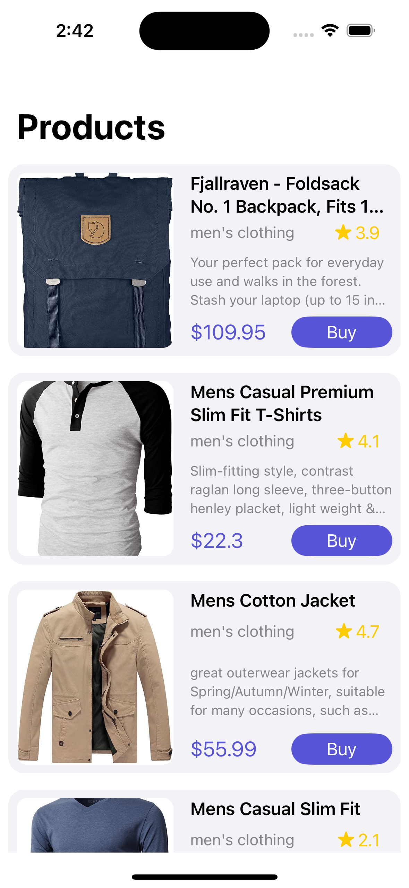

# MVVM (Model View ViewModel) + Data Binding + Singleton + Generic API Calls + SOLID Principle

In this video we learn about the Model View ViewModel (MVVM) Design Pattern.
We start by understanding how each component connects with themselves, then we implement an example project (Products API) using the MVVM pattern.
We also learn how to bind our View with our ViewModel using the Closure(Data Binding) method.

Products Light Mode    |  Products Dark Mode
:-------------------------:|:-------------------------:
|

## Characteristics

- [x] UIKit
- [x] MVVM architecture
- [x] Data Binding
- [x] Singleton Design Pattern
- [x] URLSession - Generic Api calls - Networking API
- [x] Decodable Protocol with JSONDecoder
- [x] Downloading Image - Kingfisher Library
- [x] Swift Package Manager - SPM
- [x] Closure, Completion, Typealias, Enum
- [x] Detailed use of UIStackView, UITableView, UITableViewCell XIB
- [x] Inheritance - Final Keyword, Init()
- [x] Memory Management
- [x] Light and Dark Mode

## Resources
- MVVM Keynotes: https://raw.githubusercontent.com/YogeshPateliOS/MVVM-Products-List-API/main/MVVM.key
- Youtube Video: https://youtu.be/fMO03NUjdj8

## Say Hi on Social Media:
- Linkedin: https://www.linkedin.com/in/yogeshpatelios
- Instagram: https://www.instagram.com/codewithyogesh

## My Applications:

- BMI Weight Loss Calculator: https://apps.apple.com/us/app/bmi-weight-loss-calculator/id6444039190
- My Music - Play & Share: https://apps.apple.com/us/app/my-music-play-share/id1559774882

### YOUTUBE:
If you enjoyed this project and found it useful, please share and recommend it so others can find it 💚💚💚💚💚💚 !!!!
https://youtube.com/yogeshpatelios - Please Like, Subscribe and share if it found useful for you 🤟

### Enjoy!!! 😀
