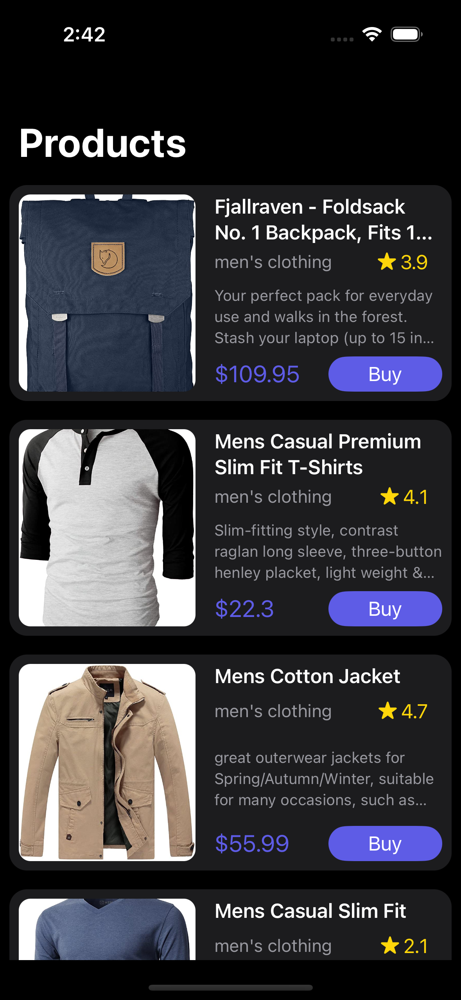

# MVVM (Model View ViewModel) + Data Binding + Singleton

A simple app using the [Rick and Morty API](https://rickandmortyapi.com) written in Swift to display the characters, locations and episodes from the [show](https://en.wikipedia.org/wiki/Rick_and_Morty):

Products Light Mode    |  Products Dark Mode
:-------------------------:|:-------------------------:
|

## Characteristics

- [x] UIKit
- [x] MVVM architecture
- [x] Data Binding
- [x] Singleton Design Pattern
- [x] URLSession - Networking API
- [x] Decodable Protocol with JSONDecoder
- [x] Downloading Image - Kingfisher Library
- [x] Swift Package Manager - SPM
- [x] Closure, Completion, Typealias, Enum
- [x] Detailed use of UIStackView, UITableView, UITableViewCell XIB
- [x] Inheritance - Final Keyword, Init()
- [x] Memory Management
- [x] Light and Dark Mode

## Say Hi on Social Media:
Linkedin: https://www.linkedin.com/in/yogeshpatelios
Instagram: https://www.instagram.com/codewithyogesh
